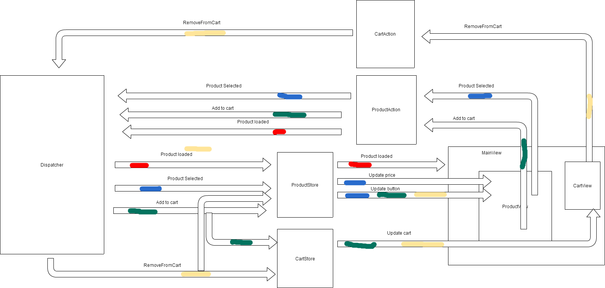

# flux-react-app
A simple app made with react and using flux pattern. For this example I used the npm library created by facebook for flux architecture. Modules were created with browserify and the views are created with react js. I compiled everything with babelify.

## Architecture

Note: each color marks with arrows are invoqued when an event is triggered, i.e All arrows with blue are triggered when a product is selected

I covered everything, but the views, with tests, using jest tool. You can find them under /js/__test__/

## Running the app

### Init the local server

    1. go to your local copy of the repository
    2. npm install to instal node dependencies
    3. grunt http-server:dev to init the server. Index will be open in the browser

### Building the code

    1. go to /yourlocalcopy/js
    2. npm install
    3. npm run build
    4. go to /yourlocalcopy/
    4. open index.html in your favourite browser :)

## Running the unit tests

    1. go to /yourlocalcopy/js
    2. npm run test

Enjoy! :)
    